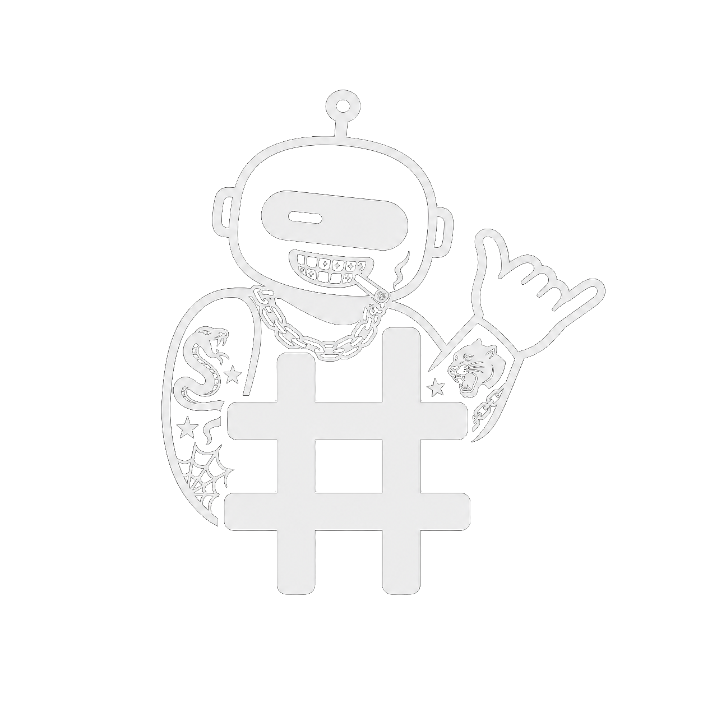

  

  <strong>Локальный бот для игры «Тюряга»</strong> 
  Версия 1.0.0 · Windows

  
  
  

PBot — локальный бот для игры «Тюряга». Он помогает автоматизировать игровые действия и работает на вашем компьютере через удобный интерфейс в браузере. Для входа понадобится `InitData` или `accessToken` игрового аккаунта; вместе с `accessToken` можно указать `refreshToken`. После первого входа аккаунт сохранится в PBot, и повторно вводить данные при каждом запуске не потребуется.

## Как установить и запустить PBot

1. Откройте раздел **Releases** справа на странице репозитория.
2. Скачайте архив
3. Полностью распакуйте архив в отдельную папку. Не запускайте PBot прямо из ZIP.
4. Запустите файл `01-install-requirements.bat` и дождитесь сообщения `[requirements] Done.`
5. Запустите файл `start-ui.bat`.
6. PBot автоматически откроется в браузере, который выбран в Windows по умолчанию. Это может быть Chrome, Edge, Firefox или другой установленный браузер. Если страница не открылась, перейдите на <http://127.0.0.1:4311> вручную.
7. При первом запуске войдите по `InitData` либо переключитесь на вкладку **«По токену»** и укажите `accessToken` (и, при наличии, `refreshToken`). Перед сохранением PBot проверит токены через игровой API.

В дальнейшем для запуска PBot достаточно открывать `start-ui.bat`.

## Как получить InitData

`InitData` нужно получить отдельно для каждого игрового аккаунта.

1. Откройте [Telegram Web](https://web.telegram.org/) в браузере и войдите в свой Telegram-аккаунт.
2. Нажмите `F12`, чтобы открыть инструменты разработчика. Также можно нажать `Ctrl+Shift+I`.
3. Перейдите во вкладку **Network / Сеть**.
4. Запустите мини‑приложение «Тюряга».
5. В строке поиска на вкладке Network введите `login`.
6. Откройте найденный запрос `login`.
7. Перейдите в раздел **Payload / Полезная нагрузка**.
8. Скопируйте значение поля `initData` целиком и вставьте его на экране входа PBot.

Если запрос `login` не появился:

1. Откройте в инструментах разработчика **Application → Storage → Local Storage**.
2. Удалите значения `accessToken` и `refreshToken`.
3. Перезапустите игру и повторите поиск запроса `login` во вкладке Network.

> [!CAUTION]
> Никому не отправляйте свои `InitData`, `accessToken` и `refreshToken`. Они используются для входа в игровой аккаунт.

## Несколько аккаунтов

После первого успешного входа аккаунт появится в списке сохранённых. Чтобы добавить ещё один аккаунт или переключиться между ними, откройте в PBot вкладку **Система → Аккаунт и авторизация**.

## Если PBot не запускается

- Снова запустите `01-install-requirements.bat` и дождитесь завершения установки.
- Если во время первой установки было установлено дополнительное программное обеспечение, перезагрузите компьютер и повторите запуск.
- Убедитесь, что PBot полностью распакован из ZIP-архива.
- Если браузер не открылся автоматически, перейдите на <http://127.0.0.1:4311>.
- Если порт занят, запустите `start-ui.bat --port 4312` и откройте <http://127.0.0.1:4312>.
- Если вход перестал работать, получите свежую `InitData` или новые токены и добавьте их на экране входа.

## Возможности PBot

- автоматизация тюрьмы;
- бои с боссами и управление очередью;
- зарубы;
- работа с друзьями;
- посылки, баулы и награды;
- статистика урона;
- переключение между несколькими аккаунтами.

